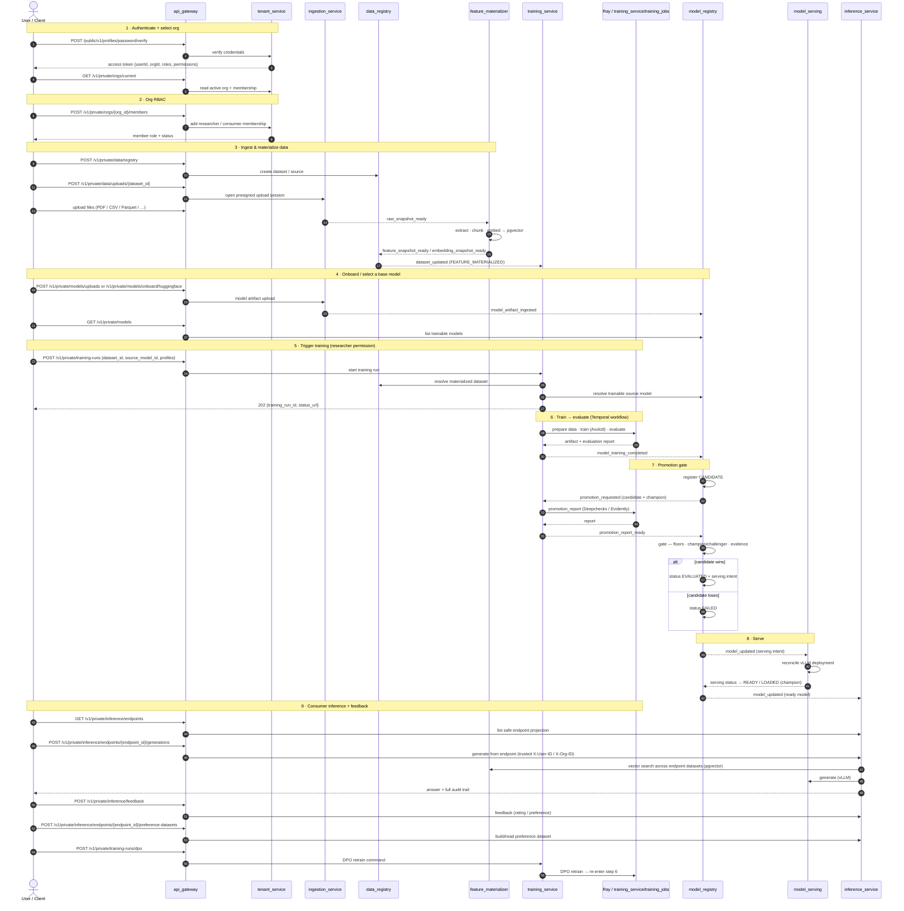

# BigHill

**A self-hosted platform for building RAG and fine-tuned LLM systems.**

BigHill is a set of Go microservices tied together with Temporal workflows, Kafka events, per-service
Postgres databases, pgvector for retrieval, Ray/KubeRay for training jobs, Kubernetes-backed vLLM
serving, and guarded agent/tool execution. Python is confined to the GPU batch jobs. It owns the
whole lifecycle — data, models, inference, feedback, agent trajectories, and retraining.

## Tech Stack

### Languages / Runtimes

- Go: main language for microservices, shared libraries, Lambda handlers, operators, Kafka tooling, and control-plane logic.
- Python: training/evaluation jobs, Hugging Face onboarding helpers, artifact validation, infra bootstrap scripts, and local test stubs.
- Rust: DataFusion query-engine subprocess used by data_stream_service.
- C++ / Poppler: native PDF extraction through pdf_extractor_lib.
- SQL: per-service schema migrations and database state.
- Shell / Make: local development, build, test, and deployment orchestration.

### APIs / Service Communication

- HTTP / REST: external and private service APIs.
- gRPC / Protocol Buffers: internal service contracts and strongly typed service calls.
- Arrow Flight: high-throughput columnar query API for data_stream_service.
- WebSockets: socket_service pushes user-visible status and error events to subscribed clients.
- AWS Lambda + API Gateway: edge API and request authorizer runtime.
- AWS SAM / OpenAPI / CloudFormation: local Lambda/API Gateway development and gateway deployment wiring.

### Persistence / State / Messaging / Workflow

- PostgreSQL: service-owned source-of-truth databases.
- Aurora PostgreSQL: managed Postgres target in AWS environments.
- pgvector: vector storage and similarity search for retrieval.
- Postgres transactional outbox: publishes events atomically with database writes.
- Kafka: asynchronous domain events between services.
- Redis: sessions, token revocation, OAuth state, socket tickets, and user-event streams/pubsub.
- Temporal: durable long-running workflows, especially training/materialization orchestration.
- AWS SQS: dead-letter queues for failed async processing paths.
- AWS KMS: JWT signing/key integration for auth.
- JWT / OAuth / Argon2id: authentication, sessions, OAuth login, and password hashing.

### ML / RAG / Model Runtime

- vLLM: production/staging model serving runtime with OpenAI-compatible APIs (alternatives: TensorRT-LLM, SGLang).
- Ollama: local-dev/CI model runtime and GGUF/chat-template validation path; not the production serving layer.
- LoRA / Multi-LoRA: serves many fine-tuned adapters on shared base model runtimes.
- QLoRA: supported training recipe style for efficient fine-tuning.
- GGUF: local model artifact format validated for Ollama-compatible serving.
- Hugging Face Hub: model onboarding/download source.
- Ray / KubeRay: distributed training and evaluation job execution (alternative scheduler: SLURM).
- Axolotl-style recipes: generated SFT/DPO/LoRA training configuration (alternative framework: NVIDIA NeMo).
- SFT: supervised fine-tuning workflow.
- DPO: preference-based retraining workflow.
- TEI-compatible endpoints: embeddings and reranking providers.
- Ragas: RAG evaluation tooling.
- Deepchecks / Evidently: promotion/evaluation evidence for model registry gates (alternative/adjacent tracking layer: MLflow).
- OpenAI-compatible chat completions: common generation protocol for vLLM and compatible runtimes.
- Ollama generate API: local generation protocol for Ollama-backed models.
- tiktoken-go: token-aware prompt/context budgeting.
- Agent loop: guarded generate -> tool -> observe -> generate runtime for agent-mode endpoints.
- tool_service: isolated execution boundary for world-acting tools, starting with allowlisted `http_get`.
- JSON Schema: source-of-truth contract for agent specs; future eval/training schemas land with their runtimes.

### Data / Lakehouse / Query

- Apache Arrow: columnar in-memory/data exchange format.
- Arrow IPC: framed columnar output from the Rust query engine.
- Apache DataFusion: SQL/query execution engine for local/lakehouse-style reads.
- Apache Parquet: snapshot and feature data storage format.
- Apache Iceberg: lakehouse table format target.
- Apache Polaris: Iceberg REST catalog integration.
- Project Nessie: local/lakehouse catalog source used in data-source compose setup.
- OpenDAL S3 storage: Rust Iceberg/DataFusion S3-backed storage integration.
- S3 / S3-compatible storage: raw uploads, snapshots, model artifacts, evaluations, and preference datasets.
- MinIO: local S3-compatible object storage.
- Postgres / MySQL / MongoDB / ClickHouse / Oracle: supported local datasource fixtures/connectors.
- PDF / HTML / Markdown / text / JSON / CSV: input formats handled by ingestion/materialization.

### Infrastructure / Deployment

- Docker: service images.
- Docker Compose: local infra and service stack.
- Kubernetes: service, training, and serving orchestration.
- Helm: Kubernetes packaging for services and platform dependencies.
- Terraform / OpenTofu: AWS infrastructure provisioning.
- AWS EKS: Kubernetes runtime in AWS.
- AWS ECR: container image repository.
- AWS S3: object storage.
- AWS IAM / IRSA: service identity and AWS access from Kubernetes.
- AWS VPC / subnets / NAT / VPC endpoints: network substrate.
- AWS Secrets Manager: deployment-time secret discovery/sync.
- NVIDIA device plugin: GPU scheduling in Kubernetes.
- AWS Load Balancer Controller: Kubernetes ingress/load balancer integration.
- ExternalDNS: Kubernetes-driven DNS records.
- CodeArtifact: native artifact repository, especially for PDF extraction builds.

### Observability / Testing

- OpenTelemetry / OTLP: traces and metrics export.
- Prometheus / Grafana: metrics collection and dashboards.
- Loki / Promtail / Tempo: logs and traces in the observability stack.
- Logrus: structured Go logging.
- Ginkgo / Gomega: Go integration and behavior tests.
- testify: Go assertions/helpers where used.
- go-playground/validator: request/config DTO validation.
- pgx: Go PostgreSQL driver.
- rueidis: Go Redis client.
- confluent-kafka-go: Go Kafka client.

---

## Why BigHill?

An LLM project usually begins as a notebook or a single Python app, then stalls the moment it has to
be real — more than one tenant, an audit trail, a way to retrain on feedback, a gate that stops a
worse model from shipping, and serving that survives a restart. Retrofitting those is the expensive
part. BigHill gives you the spine on day one:

- **The whole lifecycle in one system** — ingestion, retrieval, training, evaluation, promotion,
  serving, and a feedback → DPO retrain loop wired end to end.
- **Experimentation beyond notebooks** — POST a training run (dataset + source model + profiles) and
  get back an evaluated, gated model instead of hand-writing training, eval, and serving glue.
  Content-addressed snapshots skip repeated work, and every run is reproducible and comparable against
  its champion.
- **Correct by construction** — service-owned Postgres, a transactional outbox so an event never
  outruns its state, and a promotion gate that won't serve a model that regresses against its
  champion.
- **Multi-tenant and auditable from the start** — every dataset, embedding, prompt, response, and
  model version is attributable to a tenant.
- **Laptop to Kubernetes on one contract** — the same provider contract across local-dev, CI,
  staging, and prod.

It's a strong starting point when what you're building *is* a RAG or fine-tuning platform. It's the
wrong one for a quick chatbot or for non-LLM ML — see [When to use it](#when-to-use-it).

---

## The shape of it

Data flows through the platform roughly like this:

```
data ─▶ registry ─▶ ingestion ─▶ feature materialization ─▶ embeddings
     ─▶ training / evaluation ─▶ model registry ─▶ serving ─▶ inference
     ├▶ RAG answers ─▶ feedback ─▶ preference datasets ─▶ DPO / retrain
     └▶ agent loop ─▶ tools ─▶ trajectories ─▶ future agent eval / retrain
```

The design follows the **FTI split — Feature, Training, Inference** — as an event-driven platform:
each service owns its own database, events cross between services, and long-running work runs as
durable Temporal workflows. Kubernetes, Ray, and vLLM handle the ML runtime; the heavy Python/GPU work
stays in batch jobs behind clean boundaries.

> **Maturity:** the core lifecycle is implemented and covered by end-to-end tests — ingestion,
> materialization, training, champion/challenger promotion, serving, RAG inference, agent spec
> publishing, guarded tool calls, and the feedback-driven DPO retrain loop all run. The areas still
> maturing are **multi-LoRA serving**, **agent evaluation/training**, **deeper evaluation**
> (Ragas/DeepEval, golden sets, drift), and the **full lakehouse path** (Iceberg / Polaris / Nessie).
> See [Where it's headed](#where-its-headed).

---

## What it does

- Registers **datasets and their sources**.
- Ingests **dataset files and model artifacts** through presigned upload sessions; data files include
  PDF, HTML, Markdown, text, JSON, CSV, and Parquet, with format detection and validation.
- Extracts and chunks documents, including PDF extraction via `pdf_extractor_lib`.
- Builds **feature and embedding snapshots**, content-addressed so re-runs don't duplicate work.
- Stores and searches vectors with **pgvector** (vectors and metadata live together in Postgres).
- Serves **RAG inference** across **one or more datasets per endpoint**, with a configurable merge
  strategy (`reranker` or `score_normalized`): retrieval, reranking, query rewriting, prompt packing,
  generation, and a full audit trail of every request.
- Publishes **agent specs** as immutable, content-addressed YAML/JSON artifacts that bind a model,
  tools, budgets, and guardrails.
- Runs **agent-mode endpoints** through a bounded loop: generate, execute authorized tools, feed tool
  results back, and stop on a final answer, budget, loop detection, or failure.
- Executes **world-acting tools** through `tool_service`, which enforces tenant allowlists, argument
  validation, egress controls, timeouts, response caps, and boundary audit.
- Records **agent trajectories** as structured run/step/tool-invocation state for audit and future
  trajectory evaluation or training.
- Captures **feedback** and turns it into **preference datasets** for alignment.
- Runs **SFT and DPO training** on Ray/KubeRay using Axolotl-style recipes.
- **Evaluates models and gates promotion** through the model registry (absolute floors +
  no-regression-vs-champion + evidence).
- **Reconciles serving** through a Kubernetes serving layer to vLLM.
- Uses **Kafka events** and a **Postgres outbox** to keep services consistent without coupling them.
- Ships with **local dev, Docker Compose, Helm, VS Code wiring, and end-to-end tests**.

---

## How it's put together

Two short design docs cover the load-bearing choices — read these first:

- **[ADR-0001 — Open Lakehouse Query Stack](docs/adr/0001-open-lakehouse-query-stack.md):** Go owns the
  APIs, metadata, orchestration, events, and observability. The data side uses a vendor-neutral
  registry and an Arrow/DataFusion query boundary, so Python never becomes the control plane.
- **[ADR-0002 — Temporal and Event Delivery](docs/adr/0002-temporal-and-event-delivery-boundaries.md):**
  services that own data publish events through a **Postgres outbox** in the same transaction as the
  write, so an event never exists without the state behind it. Training workflows publish from
  Temporal activities. Consumers are built to handle duplicates.

The recurring discipline: **Postgres for each service's state, Kafka for events between services,
Temporal for durable workflows, and Kubernetes/Ray/vLLM for the ML runtime.** Every service uses the
same hexagonal layering — `pkg/domain` (the model), `pkg/app` (the logic and its interfaces),
`pkg/infra` (the adapters: DB, messaging, network) — and ships its own Helm chart.

The agent/tool design is described in [Agent Tool Plane](docs/agent-tool-plane.md). The short version:
`inference_service` owns the loop and durable trajectory state; `tool_service` owns execution of
tools that can reach outside inference; `data_contracts/schemas` owns the JSON Schema contracts.

---

## Agent rails

The agent work in this repo is deliberately a set of rails, not an unbounded autonomous runtime.
An endpoint can still be ordinary RAG, but it can also bind an agent spec and run in agent mode. In
agent mode the runtime asks the model for either a final answer or structured tool calls. Tool calls
are validated, executed, recorded, and fed back into the next generation step until the run ends.

The first local tool is `search_knowledge`, which wraps the same tenant-scoped pgvector retrieval used
by RAG. Tools that act outside inference go through `tool_service`; the current remote tool is
`http_get`. That service is intentionally narrow: it validates the caller org/user, rejects unknown
or disabled tools, validates arguments, allows only configured hosts, blocks internal network targets,
disables redirects and environment proxies, caps response size, applies timeouts, and writes a
boundary audit record. The point is capability containment: even if a prompt injection convinces the
model to ask for a dangerous call, the tool can only do what tenant policy permits.

Agent runs are not just logged as text. They are persisted as trajectories: a run row, ordered step
rows, and tool invocation rows. The trajectory pins the tuple that produced the behavior, including
the agent spec hash, resolved toolset hash, decoding params, presented tool schemas, generation
result, tool arguments/results, implementation version, error type, status, and stop reason. This
makes a run refetchable for debugging now without declaring unbuilt training lifecycle state.

### Schema design

The agent contracts live in [`data_contracts/schemas`](data_contracts/schemas):

- [`agent_spec.schema.json`](data_contracts/schemas/agent_spec.schema.json) is the authoring contract.
  Users can write YAML, but the service converts it to JSON, validates it against this schema, then
  canonicalizes and hashes it. The spec must name a lineage, model binding (`model_id`), tools, and
  budgets (`max_steps`, `token`, `wall_ms`). The schema owns shape; publish-time policy owns
  decisions such as budget caps, tool availability, and model capability.

The schema file is the cross-language contract. Go enforces it at the DTO adapter boundary before
app code receives domain objects, then applies service policy. The original YAML is retained for
human diffing, and the canonical JSON is the executed artifact. Python jobs can consume generated
read-only models from the same schemas, but the control-plane authority stays in Go and the JSON
Schemas.

---

## Runtime environments

Services read the runtime mode from `ENVIRONMENT`. The repo-standard values are `local-dev`, `cicd`,
`staging`, and `prod` (trimmed and uppercased internally before comparison). Unset or unknown values
are **not** treated as dev and fail closed. `env.IsDevEnv()` is true only for `local-dev` and `cicd`,
so staging and prod share the same fail-closed behavior.

| Environment | `IsDevEnv()` | Runtime provider contract | Storage policy | Failure behavior |
|-------------|--------------|---------------------------|----------------|------------------|
| `local-dev` | true | Local-compatible generation, TEI-compatible embeddings/reranking | `local-dev-bucket` allowed | Missing provider names/endpoints/models fail startup |
| `cicd` | true | Same contracts as local, backed by test-owned protocol-compatible services | Test-local buckets allowed | Same fail-closed startup policy |
| `staging` | false | Production-parity generation, embeddings, reranking | `local-dev-bucket` rejected | Same fail-closed startup policy |
| `prod` | false | Production generation, embeddings, reranking | `local-dev-bucket` rejected | Same fail-closed startup policy |

The provider contract is identical across environments: model records carry `serving_protocol`,
`serving_target`, and `serving_model`, and `inference_service` dispatches to the matching generation
adapter from that recorded state. What changes by environment is how that serving state is produced:

| Orchestrated path | `local-dev` / `cicd` service scripts | `staging` / `prod` |
|-------------------|--------------------------------------|--------------------|
| Model serving reconciliation | Local served-model store; no Kubernetes/vLLM required | Kubernetes `ServedModel` CRD, vLLM Deployment/Service reconciliation |
| Model registry serving backend | Local served-model backend | Kubernetes `ServedModel` backend |
| Training execution | Direct Ray Jobs API | KubeRay job creation from Temporal activities |
| Hugging Face model downloads | Local command execution | Kubernetes Job execution |

Two operational limits are worth calling out:

- `INFERENCE_SERVICE_GENERATION_MAX_OUTPUT_TOKENS` is the hard output cap. Local/CI use `24` to keep
  CPU-bound Ollama e2e calls inside the generation timeout; staging/prod use `256`. Raise it
  deliberately only for workloads that need longer answers.
- `INFERENCE_SERVICE_HTTP_WRITE_TIMEOUT_SECONDS` **must exceed**
  `INFERENCE_SERVICE_GENERATION_REQUEST_TIMEOUT_SECONDS` — otherwise the gateway sees an EOF even
  though generation finishes in the inference handler.

The test suite runs against the datasource compose stack by default. `make test` includes the
`data_stream_service` datasource integration specs, and `make test-api` starts the Postgres, MySQL,
MongoDB, and ClickHouse datasource fixtures before running the `external-datasource` API specs. Use
`make test-api-data-sources` when you only want the datasource-backed API specs.

Serving detail (the local Ollama backend, GGUF onboarding, and the model-family / chat-template
boundary) lives in [`model_serving_service/README.md`](model_serving_service/README.md). One trap is
load-bearing enough to surface here: **model-family agnostic does not mean template-agnostic.** A base
(non-Instruct) model, or a GGUF served without its chat template, returns HTTP 200 with a fluent but
wrong answer. BigHill enforces the chat template as a **provisioning precondition** (not an output
assertion) so these fail closed; when onboarding GGUF for chat inference, use the **Instruct** build.

---

## End-to-end flow

This is the main path from a user logging in to a self-improving model serving inference. Solid
arrows (`──▶`) are **synchronous** calls (HTTP through the gateway, gRPC, Temporal activities);
dashed arrows (`⤍`) are **asynchronous events** delivered over Kafka via each service's Postgres
outbox. Event names are the real message types from `data_contracts` / `shared_lib/messaging`.



**Walking the flow:**

1. **Authenticate + select org.** Everything enters through `api_gateway`, which delegates auth to
   `tenant_service`. Tokens carry the active `orgId`, role, and derived permissions. The gateway
   injects trusted `X-User-ID` / `X-Org-ID` headers and rejects spoofed inbound identity headers.
2. **Org RBAC.** Organization membership is managed through `GET /v1/private/orgs/current`,
   `GET /v1/private/orgs/{org_id}/members`, `POST /v1/private/orgs/{org_id}/members`,
   `PUT /v1/private/orgs/{org_id}/members/{user_id}`, and
   `DELETE /v1/private/orgs/{org_id}/members/{user_id}`. `ml_researcher` can upload data/models
   and start training; `consumer` can only list/invoke inference endpoints and submit feedback.
3. **Ingest & materialize.** A dataset and its source are registered in `data_registry`;
   `ingestion_service` hands back a presigned upload session and lands the raw files.
   `feature_materializer` picks up `raw_snapshot_ready`, extracts and chunks documents, embeds them,
   and writes vectors to **pgvector** — content-addressed, so re-runs don't duplicate work. When the
   snapshot is materialized, `data_registry` publishes `dataset_updated`.
4. **Onboard / select a base model.** Base models are uploaded through `ingestion_service` and
   registered in `model_registry` (`model_artifact_ingested`); trainable models are listed via
   `GET /v1/private/models` (org-scoped: shared bases plus your own).
5. **Trigger training.** Training is **user intent, not a hidden default** — a researcher POSTs the
   dataset, the source model, and named profiles to `POST /v1/private/training-runs`.
   `training_service` resolves the materialized dataset and the trainable source model, validates
   them, and returns a `training_run_id` immediately. The base model is carried as *data*, never as
   service config.
6. **Train → evaluate.** A durable Temporal workflow prepares the data, runs the GPU training job on
   Ray (`training_service/training_jobs`, Axolotl-style recipes), evaluates the result, and emits
   `model_training_completed`.
7. **Promotion gate.** `model_registry` records the new model as a **CANDIDATE** — it is *not* served
   yet — and asks `training_service` for a promotion report (Deepchecks / Evidently). The gate then
   compares the candidate against the current **champion** for that lineage (absolute floors +
   no-regression + evidence), promoting to `EVALUATED` or rejecting to `FAILED`. This is the guard
   that keeps the retrain loop safe.
8. **Serve.** On promotion, `model_registry` records serving intent; `model_serving` reconciles a
   vLLM deployment and reports back until the model is `READY / LOADED` — at which point it becomes
   the new champion. Inference learns the ready model via `model_updated`.
9. **Consumer inference + feedback loop.** Consumers list safe endpoint projections with
   `GET /v1/private/inference/endpoints` and invoke with
   `POST /v1/private/inference/endpoints/{endpoint_id}/generations`. Request bodies carry query
   controls only; `user_id`, `org_id`, `model_id`, and the endpoint's **dataset set** and **merge
   strategy** are resolved from the trusted token/header context and the published endpoint —
   retrieval fans out across every ready dataset and merges the results. Endpoints are published and
   configured explicitly with `POST /v1/private/inference/endpoints`,
   `PUT /v1/private/inference/endpoints/{endpoint_id}/datasets`, and
   `PUT /v1/private/inference/endpoints/{endpoint_id}/merge-strategy`. Captured feedback can be
   written explicitly with `POST /v1/private/inference/endpoints/{endpoint_id}/preference-datasets`
   and inspected with `GET /v1/private/inference/preference-datasets`. A researcher then starts
   DPO deliberately with `POST /v1/private/training-runs/dpo` using the selected
   `preference_dataset_id`; the source model is resolved from the preference dataset lineage, not
   config, and the run re-enters step 6.

---

## What's in the repo

| Path | What it does |
|------|--------------|
| `data_registry_service/` | Dataset and source metadata |
| `ingestion_service/` | Presigned upload sessions, file validation, raw data landing, model artifact landing |
| `pdf_extractor_lib/` | PDF text/structure extraction |
| `feature_materializer_service/` | Snapshots, chunking, embeddings, pgvector search |
| `data_stream_service/` | Arrow Flight query gateway + DataFusion executor (`internal/`) |
| `training_service/` | Temporal training workflows (SFT/DPO), Ray/KubeRay dispatch |
| `training_service/training_jobs/` | Python GPU jobs (Axolotl train, evaluation) run by Ray |
| `model_registry_service/` | Model records, promotion gating, serving intent + status, outbox |
| `model_serving_service/` | K8s operator that reconciles serving to vLLM; `localserving` for dev |
| `inference_service/` | RAG inference, agent loop, retrieval/rerank/query-rewrite, generation, trajectories, feedback |
| `tool_service/` | Isolated execution boundary for world-acting agent tools |
| `tenant_service/` | Auth (OAuth / password) and user profiles |
| `api_gateway/` | Edge (Lambda auth/api) and end-to-end API tests |
| `data_contracts/` | Protobuf event/service contracts and JSON Schema agent contracts |
| `shared_lib/` | Shared plumbing: messaging, outbox, DB, metrics/tracing, auth, object storage, K8s client |
| `infra/`, `database/`, `scripts/` | Infra manifests, DB, tooling |
| `docs/adr/` | Design docs |

---

## Getting started

You'll need Go, Docker, and — for the ML runtime — access to Kubernetes / Ray / GPUs. Most things run
from the root `Makefile`:

```bash
make install-dev      # install dev dependencies
make start-infra      # start local infra (Kafka, Postgres, object storage, …)
make start-servers    # start the Go services
make test             # run the tests
make stop             # tear it all down
```

- **Local dev:** Makefile targets + Docker Compose, with VS Code launch configs.
- **Kubernetes:** each service has a Helm chart under `<service>/helm/`.
- **Query engine:** `make build-query-engine` / `make test-query-engine` build the DataFusion executor
  behind the data-stream query boundary.

---

## When to use it

BigHill fits when you want to run an LLM platform yourself and care about repeatable
data-to-model pipelines, auditability (datasets, embeddings, prompts, responses, feedback, model
versions), independently scaling services, event boundaries instead of shared databases, multi-tenant
model and adapter lifecycles, and RAG + fine-tuning + feedback-driven improvement in one system, with
a path from a laptop to Kubernetes.

It's **not** the right tool for a quick chatbot — LangChain, LlamaIndex, Haystack, or a managed RAG
service will get you there faster. BigHill is heavier on purpose: it's meant to sit *under* many
systems rather than be one. Compared to managed platforms (SageMaker / Vertex / Azure ML) it trades
convenience for control and self-hosting; compared to application frameworks it owns far more of the
lifecycle (ingestion, registry, workflows, serving state, promotion, feedback, training).

---

## Where it's headed

The core serve → feedback → preference data → DPO → eval → promote → serve loop is wired end to end.
The next work is depth and reliability, not first light:

- Make the **DPO / feedback loop boringly reliable** and proven, including held-out train/eval splits
  so a new model is only promoted when it actually beats the one it came from.
- **Better evaluation:** Ragas / DeepEval, pairwise preference eval, golden sets, drift checks.
- **Mature multi-LoRA serving** so one base model can serve many tenant adapters cheaply.
- **Better RAG:** structure-aware chunking, hybrid BM25 + vector search, self-querying, HyDE, query
  expansion.
- **Agent lifecycle:** trajectory eval, golden task promotion gates, and agent adapter retraining on
  the same feedback-driven spine as model DPO.
- **Push the lakehouse path:** Iceberg, Polaris / Nessie, DataFusion, Arrow Flight.
- **Product surfaces:** lineage UI, feedback review, eval dashboards, deployment status, tenant controls.
- **Harden the Kubernetes controller**, leaning more on standard controller-runtime / KServe / KubeRay
  patterns.

---

## Bottom line

BigHill is a self-hosted platform for RAG, fine-tuning, evaluation, serving, and feedback-driven
improvement, built on service-owned state, a Postgres outbox, Temporal, Kafka, and explicit contracts.
It takes more to run than a lightweight framework and is less polished than the big commercial
platforms, but it owns the full lifecycle of data, models, inference, feedback, and retraining in one
system that's meant to be extended.
