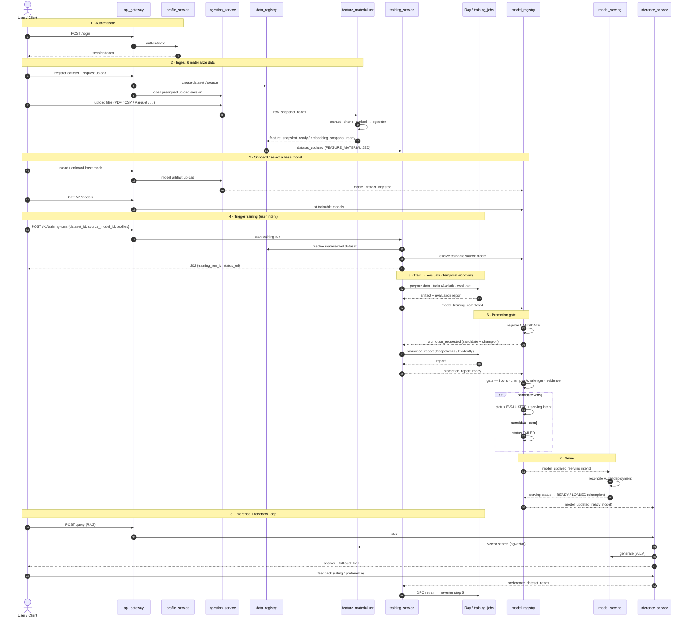

# BigHill

**A self-hosted platform for building RAG and fine-tuned LLM systems.**

BigHill is an ML platform consisting of a set of Go microservices tied together with Temporal workflows, Kafka events, per-service Postgres databases, pgvector for retrieval, Ray/KubeRay for training jobs, and vLLM-style serving. Python shows up only where it belongs: the GPU batch jobs.

Is **own the whole lifecycle** — data, models, inference, feedback, and retraining.

---

## The shape of it

Data flows through the platform roughly like this:

```
data ─▶ registry ─▶ ingestion ─▶ feature materialization ─▶ embeddings
     ─▶ training / evaluation ─▶ model registry ─▶ serving ─▶ inference
     ─▶ feedback ─▶ preference datasets ─▶ DPO / retrain
```

The design follows the **FTI idea — Feature, Training, Inference** — but built as a real platform
instead of a single Python app: event-driven, each service owns its own database, and long-running
work runs as durable workflows. Kubernetes, Ray, and vLLM handle the ML runtime.

**Each service owns its state, events cross between services, and workflows coordinate
the slow steps.** That's a cleaner way to run things than most LLM platforms manage.

> **Heads up:** this is an emerging platform. The infrastructure is solid and well-reviewed, but some
> pieces (multi-LoRA serving by default, the self-improving DPO loop, the full lakehouse path) are a
> direction we're building toward, not finished work. See [Where it's headed](#where-its-headed).

---

## What it does

- Registers **datasets and where they come from**.
- Ingests **dataset files and model artifacts** through presigned upload sessions; data files include PDF, HTML, Markdown, text, JSON, CSV, and Parquet with format detection and validation.
- Extracts and chunks documents, including proper PDF extraction via `pdf_extractor_lib`.
- Builds **feature and embedding snapshots**, keyed by content so re-runs don't duplicate work
  (content-addressed idempotency).
- Stores and searches vectors with **pgvector** (vectors and metadata live together in Postgres).
- Serves **RAG inference**: retrieval, reranking, query rewriting, prompt packing, generation, and a
  full audit trail of every request.
- Captures **feedback** and turns it into **preference datasets** for alignment.
- Runs **SFT and DPO training** on Ray/KubeRay using Axolotl-style recipes.
- **Evaluates models and gates promotion** through the model registry.
- **Reconciles serving** through a Kubernetes serving layer, heading toward vLLM / multi-LoRA.
- Uses **Kafka events** and a **Postgres outbox** to keep services consistent without coupling them.
- Comes with **local dev, Docker Compose, Helm, VS Code wiring, and end-to-end tests**.

---

## How it's put together

Two short design docs cover the load-bearing choices — read these first:

- **[ADR-0001 — Open Lakehouse Query Stack](docs/adr/0001-open-lakehouse-query-stack.md):** Go owns the
  APIs, metadata, orchestration, events, and observability. The data side uses a vendor-neutral
  registry and an Arrow/DataFusion query boundary, so **Python never becomes the control plane**.
- **[ADR-0002 — Temporal and Event Delivery](docs/adr/0002-temporal-and-event-delivery-boundaries.md):**
  services that own data publish events through a **Postgres outbox** in the same transaction as the
  write, so an event never exists without the state behind it. Training workflows publish from
  Temporal activities. Consumers are built to handle duplicates.

The recurring discipline: **Postgres for each service's state, Kafka for events between services,
Temporal for durable workflows, and Kubernetes/Ray/vLLM for the ML runtime.** The heavy Python/GPU
work stays in batch jobs behind clean boundaries.

---

## End-to-end flow

This is the main path from a user logging in to a self-improving model serving inference. Solid
arrows (`──▶`) are **synchronous** calls (HTTP through the gateway, gRPC, Temporal activities);
dashed arrows (`⤍`) are **asynchronous events** delivered over Kafka via each service's Postgres
outbox (so an event never exists without the state behind it). Event names are the real message
types from `data_contracts` / `shared_lib/messaging`.



**Walking the flow:**

1. **Authenticate.** Everything enters through `api_gateway`, which delegates auth to
   `profile_service` and injects the tenant identity that every downstream service uses for
   row-level isolation.
2. **Ingest & materialize.** A dataset and its source are registered in `data_registry`;
   `ingestion_service` hands back a presigned upload session and lands the raw files.
   `feature_materializer` picks up `raw_snapshot_ready`, extracts and chunks documents, embeds them,
   and writes vectors to **pgvector** — content-addressed, so re-runs don't duplicate work. When the
   snapshot is materialized, `data_registry` publishes `dataset_updated`.
3. **Onboard / select a base model.** Base models are uploaded through `ingestion_service` and
   registered in `model_registry` (`model_artifact_ingested`); the UI lists trainable models via
   `GET /v1/models` (tenant-scoped: shared bases plus your own).
4. **Trigger training.** Training is **user intent, not a hidden default** — the client POSTs the
   dataset, the source model, and named profiles. `training_service` resolves the materialized
   dataset and the trainable source model, validates them, and returns a `training_run_id`
   immediately. The base model is carried as *data*, never as service config.
5. **Train → evaluate.** A durable Temporal workflow prepares the data, runs the GPU training job on
   Ray (`training_jobs`, Axolotl-style recipes), evaluates the result, and emits
   `model_training_completed`.
6. **Promotion gate.** `model_registry` records the new model as a **CANDIDATE** — it is *not* served
   yet — and asks `training_service` for a promotion report (Deepchecks / Evidently). The gate then
   compares the candidate against the current **champion** for that lineage (absolute floors +
   no-regression + evidence). It promotes to `EVALUATED` or rejects to `FAILED`. This is the guard
   that makes the retrain loop safe.
7. **Serve.** On promotion, `model_registry` records serving intent; `model_serving` reconciles a
   vLLM deployment and reports back until the model is `READY / LOADED` — at which point it becomes
   the new champion. Inference services learn the ready model via `model_updated`.
8. **Inference + feedback loop.** `inference_service` answers RAG queries — retrieval from pgvector,
   rerank, query rewrite, generation on vLLM — with a full audit trail. Captured feedback becomes a
   preference dataset; `preference_dataset_ready` kicks off **automatic DPO retraining** (the source
   model resolved from lineage, not config), which re-enters step 5 and closes the self-improving
   loop.

---

## What's in the repo

| Path | What it does |
|------|--------------|
| `data_registry_service/` | Dataset and source metadata |
| `ingestion_service/` | Presigned upload sessions, file validation, raw data landing, model artifact landing |
| `pdf_extractor_lib/` | PDF text/structure extraction |
| `feature_materializer_service/` | Snapshots, chunking, embeddings, pgvector search |
| `data_stream_service/` | Arrow Flight query gateway + DataFusion executor (`internal/`) |
| `training_service/` | Temporal training workflows (SFT/DPO), Ray/KubeRay dispatch |
| `training_jobs/` | Python GPU jobs (Axolotl train, evaluation) run by Ray |
| `model_registry_service/` | Model records, promotion gating, serving intent + status, outbox |
| `model_serving_service/` | K8s operator that reconciles serving to vLLM; `localserving` for dev |
| `inference_service/` | RAG inference, retrieval/rerank/query-rewrite, generation, auditing, feedback |
| `profile_service/` | Auth (OAuth / password) and user profiles |
| `api_gateway/` | Edge (Lambda auth/api) and end-to-end API tests |
| `data_contracts/` | Protobuf event and service contracts |
| `shared_lib/` | Shared plumbing: messaging, outbox, DB, metrics/tracing, auth, object storage, K8s client |
| `infra/`, `database/`, `scripts/` | Infra manifests, DB, tooling |
| `docs/adr/` | Design docs |

Every service uses the same hexagonal layering (ports and adapters) — `pkg/domain` (the model),
`pkg/app` (the logic and its interfaces), `pkg/infra` (the adapters: DB, messaging, network) — and
ships its own Helm chart.

---

## Getting started

You'll need Go, Docker, and — for the ML runtime — access to Kubernetes / Ray / GPUs. Most things run
from the root `Makefile`:

```bash
make install-dev      # install dev dependencies
make start-infra      # start local infra (Kafka, Postgres, object storage, …)
make start-servers    # start the Go services
make test             # run the tests
make stop             # tear it all down
```

- **Local dev:** Makefile targets + Docker Compose, with VS Code launch configs.
- **Kubernetes:** each service has a Helm chart under `<service>/helm/`.
- **Query engine:** `make build-query-engine` / `make test-query-engine` build the DataFusion executor
  behind the data-stream query boundary.

---

## Who it's for

Use BigHill if you want to **own an LLM platform** instead of gluing a prototype together. It's a good
fit when you care about:

- Repeatable **data-to-model pipelines**.
- **Auditability** — datasets, embeddings, prompts, responses, feedback, and model versions.
- **Services that scale independently**.
- **Events instead of shared databases** between components.
- **Self-hosting** instead of SaaS lock-in.
- **Multi-tenant** model and adapter lifecycles.
- **RAG + fine-tuning + feedback-driven improvement** in one system.
- A path **from your laptop to Kubernetes**.

It's **not the right tool** if you just want a quick chatbot — LangChain, LlamaIndex, Haystack, or a
managed RAG service will get you there far faster. BigHill is heavier on purpose: it's meant to sit
*under* many systems.

---

## How it compares

**LangChain / LlamaIndex / Haystack** are application frameworks. BigHill is a platform — it owns
ingestion, registry, workflows, serving state, model promotion, feedback, and training. More serious
operationally, and heavier.

**ZenML / Kubeflow / Metaflow / Dagster / Airflow** focus on orchestration or ML pipelines. BigHill
uses Temporal + Kafka/outbox wrapped in real services. Cleaner event boundaries than most pipeline
tools; less mature on UI and ecosystem.

**SageMaker / Vertex AI / Azure ML** are managed. BigHill is the self-hosted version — more control,
less lock-in, and you carry more of the ops.

**MLflow** is mostly tracking, registry, and artifacts. BigHill has registry concepts too, plus the
whole event/workflow/data/serving/inference platform around them. MLflow is more mature for experiment
tracking; this is broader.

**Qdrant / Pinecone / Weaviate** are vector databases. BigHill uses pgvector, which keeps vectors and
metadata in one Postgres for easy consistency. It won't beat a dedicated vector DB on every feature or
on scale, but it's pragmatic and easy to reason about.

**KServe / Seldon / BentoML / Ray Serve** are serving platforms. BigHill is growing its own serving
reconciliation around vLLM / multi-LoRA. The direction is right; the mature platforms have more
battle-tested autoscaling, routing, and rollout. It should probably learn from (or adopt) KServe's
`ServingRuntime` / `ServedModel` split over time.

**Databricks / Snowflake / lakehouse platforms** — BigHill has a lakehouse *direction* (Arrow /
DataFusion / Iceberg) but isn't a full lakehouse yet, and it's aimed at the LLM lifecycle rather than
general analytics.

---

## Where it's headed

The main next step is to **close the loop and make it self-improving:**

```
serve ─▶ capture feedback ─▶ export preference data ─▶ DPO ─▶ eval ─▶ promote ─▶ serve
```

After that:

- Make the **DPO / feedback loop boringly reliable**, proven end to end — including a held-out
  train/eval split so a new model only gets promoted if it actually beats the one it came from.
- **Better evaluation:** Ragas / DeepEval, pairwise preference eval, golden sets, drift checks.
- **Mature multi-LoRA serving** so one base model can serve many tenant adapters cheaply.
- **Better RAG:** structure-aware chunking, hybrid BM25 + vector search, self-querying, HyDE, query
  expansion.
- **Push the lakehouse path:** Iceberg, Polaris / Nessie, DataFusion, Arrow Flight.
- **Product surfaces:** lineage UI, feedback review, eval dashboards, deployment status, tenant controls.
- **Harden the Kubernetes controller**, leaning more on standard controller-runtime / KServe / KubeRay
  patterns.

---

## Bottom line

BigHill is an **emerging** self-hosted platform for RAG, fine-tuning, evaluation, serving, and feedback-driven improvement, with service-owned state, an outbox, Temporal, Kafka, explicit contracts, clean boundaries.
Next to the big commercial platforms it's less polished, but pretty complete, it just takes more work to run. Next to lightweight frameworks it's a far more complete system and easy to extend.

Bighill **owns the full lifecycle of data, models, inference, feedback, and retraining.**
