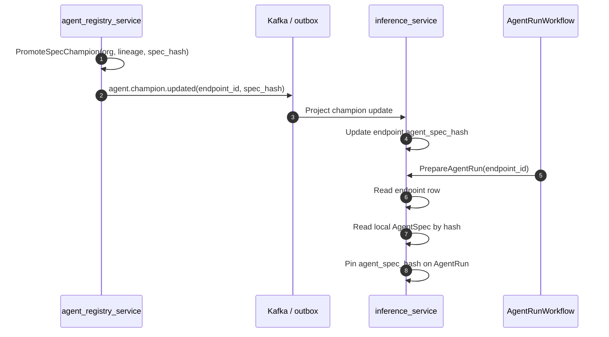

# ADR 0008: Agent Registry And Flywheel Control Plane

## Status

Accepted.

## Context

The agent runtime now records the producer-backed provenance tuple needed for later training and
evaluation:

```text
agent_spec_hash
toolset_hash
effective_base_id
data_snapshot_hash
data_snapshot_set
```

The next product milestone is one flywheel turn:

```text
trajectory -> label/eval -> dataset -> train candidate -> eval on holdout
  -> promote -> champion serves -> measured holdout lift
```

This phase must not reintroduce the phantom schema removed from the inference service. Lifecycle
tables return only when their producer, reader, policy decision, and tests land in the same vertical
slice.

## Decision

Build the flywheel as extension services attached to core-owned IDs.

The first slice is `agent_registry_service`, but its first executable scope is spec champion
selection, not adapter selection. Inference already serves by `agent_spec_hash`, so the registry can
produce a real champion decision and inference can consume it immediately by projecting that selected
hash into the core endpoint binding.

Adapter lifecycle tables return later with the slices that produce and consume adapters:

- `agent_adapters` returns with trajectory-shaped adapter training and serving compatibility.
- adapter champion state returns when model serving can bind a promoted adapter for the next run.
- rollback, stale, and quarantine states return only with transitions that write and read them.

## Ownership

| Data | Owner | Rule |
|------|-------|------|
| Agent spec bytes and canonical hash | `inference_service` | Core-owned permanently |
| Published endpoint binding | `inference_service` | Run path reads only local core rows |
| Agent lineage/version metadata | `agent_registry_service` | References `agent_spec_hash`; never stores spec bytes |
| Champion decision | `agent_registry_service` | Emits selected binding to core |
| Trajectories | `inference_service` | Exposed through a read/stream API; not shared by database |
| Golden tasks and eval reports | Later eval slice | No table until authoring and eval runner exist |
| Agent adapters | Later training/serving slices | No table until training writer and serving reader exist |

`agent_registry_service` owns `agent_registry_db`. It never reads or writes
`bighill_inference_db` directly.

## Slice 5.1a: Spec Champion Edge

This slice is the smallest honest registry vertical:

1. Register a core-authored `agent_spec_hash` as a version for an `(org_id, agent_lineage)`.
2. Select one registered version as champion for that lineage.
3. Publish `agent.champion.updated`.
4. Project the update into the core endpoint row.
5. Run future agent requests using only the endpoint row and local spec store.

### Registry Tables

`agent_lineages`

- `org_id`
- `agent_lineage`
- `created_by_user_id`
- `created_at`
- `updated_at`

Writer: lineage creation or first spec-version registration.

Reader: spec-version registration and champion selection.

`agent_spec_versions`

- `org_id`
- `agent_lineage`
- `agent_spec_hash`
- `model_id`
- `effective_base_id`
- `registered_by_user_id`
- `registered_at`
- `status` (`REGISTERED`, `ARCHIVED`)

Writer: register-spec-version command after inference confirms the spec hash exists and belongs to
the same org and lineage.

Reader: champion selection and lineage history.

`agent_endpoint_bindings`

- `org_id`
- `agent_lineage`
- `endpoint_id`
- `created_by_user_id`
- `created_at`

Writer: register-endpoint-binding command after inference confirms the endpoint belongs to the org.

Reader: champion selection, which emits one event per bound endpoint.

`agent_champion_states`

- `org_id`
- `agent_lineage`
- `champion_agent_spec_hash`
- `previous_agent_spec_hash`
- `decision_id`
- `decided_by`
- `decided_at`

Writer: promote-spec-champion command.

Reader: lineage state, endpoint projection decisions, and future eval/training slices.

These tables have live writers and readers in slice 5.1a. No golden-task, run-label, adapter, or
promotion-gate table is part of this slice.

### Registry Commands

`RegisterAgentSpecVersion`

Input:

- `org_id`
- `agent_lineage`
- `agent_spec_hash`
- `registered_by_user_id`

Behavior:

- calls inference's spec-read API to confirm the spec exists, belongs to the org, and has the same
  lineage
- records the version idempotently
- never stores spec bytes

The first implementation uses inference's existing REST read endpoints for these cold control-plane
checks. That is an explicit exception to the usual synchronous service-to-service gRPC preference,
not a run-path pattern. If this contract becomes hot, public, or broader than spec/endpoint
verification, it should move behind a dedicated internal gRPC API.

`RegisterEndpointBinding`

Input:

- `org_id`
- `agent_lineage`
- `endpoint_id`
- `created_by_user_id`

Behavior:

- calls inference's endpoint-read API to confirm the endpoint belongs to the org
- records the binding idempotently

`PromoteSpecChampion`

Input:

- `org_id`
- `agent_lineage`
- `agent_spec_hash`
- `decided_by`
- `decision_id`

Behavior:

- verifies the spec hash is a registered version
- updates `agent_champion_states`
- emits `agent.champion.updated` for each registered endpoint binding

The first version can be promoted explicitly. Later slices replace manual promotion with eval-gated
promotion.

### Event Contract

`agent.champion.updated`

```json
{
  "event_id": "uuid",
  "idempotency_key": "uuid",
  "org_id": "uuid",
  "agent_lineage": "support_agent",
  "endpoint_id": "uuid",
  "agent_spec_hash": "sha256...",
  "previous_agent_spec_hash": "sha256...",
  "decision_id": "uuid",
  "decided_at": "2026-07-18T00:00:00Z"
}
```

Consumer: `inference_service`.

Projection behavior:

- read the endpoint by `(org_id, endpoint_id)`
- read the local spec by `(org_id, agent_spec_hash)`
- verify the spec lineage matches `agent_lineage`
- update `published_inference_endpoints.agent_spec_hash` and `agent_spec_id`
- do not call `agent_registry_service` on the run path

This event is an internal control-plane fact, not a user socket event.

## Run Path

The live run path remains core-local:



A registry outage cannot stop an endpoint that already has a bound spec hash. A delayed champion
event changes future runs only; it never mutates an in-flight trajectory.

## Slice 5.2: Golden Tasks

Golden tasks are not part of slice 5.1a. They return when the authoring/import API and eval runner
exist.

Minimum slice:

- `golden_tasks` owned by the eval/registry boundary chosen for 5.2
- split-aware authoring: `seed_train`, `dev_eval`, `promotion_holdout`
- content fingerprints and group hints
- mechanical anti-leak check against holdout fingerprints
- holdout split versioning
- eval runner consumes the tasks

No training dataset builder may consume golden tasks until anti-leak is enforced mechanically.

## Slice 5.3: Eval Runner

Eval starts the same Temporal-backed agent workflow through a headless entry point with a pinned
spec hash and task input. It records real trajectories and real metric reports.

Hard rules:

- no hardcoded `passed: true`
- no scoring without a real rubric version
- candidate and champion must run on comparable holdout versions
- promotion reads the report produced by the runner

## Slice 5.4 To 5.8

These slices complete the flywheel:

1. trajectory labels written by human/model/rule evaluators
2. trajectory-shaped SFT/DPO dataset builder with anti-leak and eligibility gates
3. adapter training in `training_service`
4. promotion gate comparing candidate and champion on holdout metrics
5. serving compatibility check and Multi-LoRA binding for the promoted adapter

`agent_adapters` returns with adapter training and serving compatibility, not in the first registry
slice. Until then the registry selects spec champions only.

## Tests For Slice 5.1a

The first implementation must include:

- registering a spec version rejects a hash inference cannot read
- registering a spec version rejects a lineage mismatch
- promoting an unregistered spec hash fails closed
- promoting a registered spec writes champion state and emits `agent.champion.updated`
- inference projection rejects a missing local spec hash
- inference projection rejects a lineage mismatch
- inference projection updates only the core endpoint binding for future runs
- a run pins the pre-update spec if it already started before the projection
- registry is not called from the run path

## Consequences

- Phase 5 gets an executable first slice without reintroducing adapter or eval tables early.
- The champion edge is real immediately because inference already serves by spec hash.
- Later eval and training slices attach to the registry state without changing the hot path.
- Adapter promotion remains honest because its tables return only with training and serving readers.
