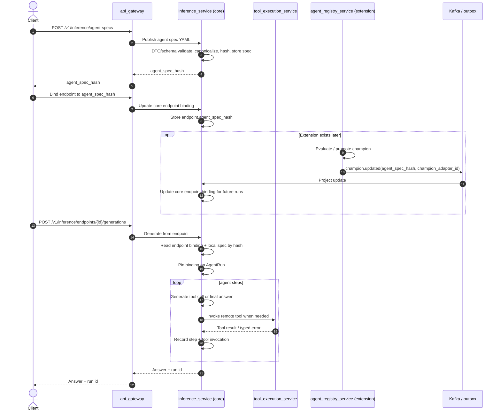
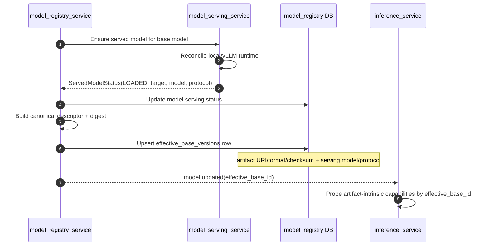

# Agent Extension Architecture

## Purpose

BigHill needs an agent architecture that can grow without turning the core runtime into a dumping
ground for every future idea. Agents may eventually need memory, golden-task evaluation, adapter
training, approvals, durable workflows, policy engines, tool catalogs, and promotion gates. Those are
real features, but they should not appear as dormant tables, enums, or JSON schemas before their
runtime exists.

This document defines the direction:

```text
core services provide stable primitives
extension services add optional capabilities vertically
```

The core owns the minimum agent substrate that every agent needs. Extension services attach to stable
core IDs and own their own state, APIs, policies, and lifecycle.

## Problem

Agent platforms usually fail in one of two ways:

- the core runtime grows until every optional feature becomes a hard dependency
- future capabilities are predeclared as schema before there is a runtime to produce or consume them

The extensible path is narrower: the core runtime owns only the primitives needed to publish, run,
observe, and read an interactive agent. Optional capabilities attach through stable IDs when their
full vertical slice exists.

A table that has no writer and no reader is not extensibility. It is a false contract. The schema
should describe capabilities the platform can execute today, and extension slices should add new
schema only with their runtime, readers, policy decisions, and tests.

## Decision

Split the architecture into:

1. **Core platform services** - always present, stable, and required for RAG/model/agent execution.
2. **Extension services** - optional capabilities added only when their full vertical slice exists.

The core exposes stable IDs and contracts. Extensions attach through those IDs instead of changing
the meaning of core rows after the fact.

No table, column, enum, JSON schema, domain type, or event type ships unless it has:

- a source-of-truth owner
- an entry-point validation path
- a runtime writer
- a read/query path
- a policy decision or user-visible use
- tests that fail if the path is not wired
- documentation that matches the implementation

## Non-Goals

The core interactive agent slice does not include:

- self-improving agent training
- agent adapter promotion
- golden-task management
- long-running Temporal agent workflows
- long-term memory governance
- human approval workflows

Those arrive as extension slices when their runtime exists.

## Core Services

Core services are the platform substrate. They should remain small enough to reason about and stable
enough for extensions to build on.

| Service | Core responsibility |
|---------|---------------------|
| `api_gateway` | Authenticated edge, routing, permission enforcement, trusted identity headers |
| `tenant_service` | Users, orgs, roles, permissions, sessions |
| `data_registry_service` | Dataset/source metadata and dataset lifecycle |
| `ingestion_service` | Upload sessions and artifact intake |
| `feature_materializer_service` | Raw/feature/embedding snapshots and pgvector materialization |
| `model_registry_service` | Model records, model promotion, serving intent, serving status projection, effective-base identity |
| `model_serving_service` | Runtime reconciliation to local serving or vLLM/Kubernetes |
| `inference_service` | RAG, interactive agent loop, generation dispatch, trajectory audit, feedback |
| `tool_execution_service` | Isolated execution boundary for world-acting tools |
| `training_service` | Generic training workflow engine for supported recipes |
| `socket_service` | Realtime user-visible event delivery |
| `data_contracts` | Protobuf and JSON Schema contracts |
| `shared_lib` | Shared platform plumbing: auth, DB, outbox, messaging, tracing, serializers |

## Core Agent Substrate

The core agent runtime should contain only values that V1 can honestly produce and consume.

| Primitive | Owned by | Purpose |
|-----------|----------|---------|
| `AgentSpec` | `inference_service` | Immutable, content-addressed agent config artifact |
| `AgentRun` | `inference_service` | One agent execution for a user turn/task |
| `AgentStep` | `inference_service` | One generation step in the loop |
| `ToolInvocation` | `inference_service` and `tool_execution_service` audit | One tool call/result/error |
| `CapabilityReport` | `inference_service` | Measured capability probe for the bound model/runtime |
| `ToolDefinition` | local registry / `tool_execution_service` in V1 | Tool name, argument schema, result contract, locality, implementation version |
| `EffectiveBaseVersion` | `model_registry_service` | Core serving identity for a loaded base model |

`AgentSpec` remains core-owned permanently. The agent registry extension may reference
`agent_spec_hash`, maintain version history, and decide which hash is champion for a lineage, but it
does not own spec bytes and does not inject spec content at runtime.

The core loop is:

```text
publish spec -> bind endpoint -> run agent -> resolve tools -> generate
  -> invoke tools -> record trajectory -> return answer -> read trajectory
```

The core provides stable identifiers for extensions:

```text
org_id
user_id
model_id
dataset_id
endpoint_id
agent_spec_id
agent_spec_hash
run_id
step_id
tool_invocation_id
tool_name
tool_impl_version
effective_base_id
```

Extensions attach to these IDs. They should not require the core to predeclare every future lifecycle.

## Optionality Rule

An extension is optional only if the live run path does not synchronously depend on it.

For agent registry and promotion, the direction is:

```text
extension decides -> emits event / calls core API -> core projects binding state
core run path -> reads endpoint row + local spec store only
```

The endpoint row is core-owned binding state. It holds the `agent_spec_hash` and, in a future adapter
slice, the selected `champion_adapter_id`. If `agent_registry_service` is absent, an endpoint still
runs with a statically pinned spec hash. If the registry exists, it pushes champion updates into
core-owned binding state. `inference_service` must not call the registry on the hot path to ask which
spec or champion to run.

Each run pins the endpoint binding it started with, including `agent_spec_hash` and any future
`champion_adapter_id`. A registry update can change future runs, but it must not reinterpret or mutate
an in-flight trajectory.

This keeps extensions optional and keeps latency/failure behavior in the core runtime predictable.

### Sequence

The same endpoint path works with or without extensions. Extension services push decisions into
core-owned binding state; the run path stays core-local.



## Extension Services

Extension services are introduced only when the feature has runtime behavior.

## Core Serving Effective-Base Flow

Effective-base identity is produced by the serving stack. It is not written by the agent runtime and
does not require `agent_registry_service`.



| Extension service | Adds | Attaches to |
|-------------------|------|-------------|
| `agent_registry_service` | Version history and champion/candidate selection over core-authored spec hashes; no spec bytes | `agent_spec_hash`, `model_id`, future `adapter_id` |
| `agent_eval_service` | Golden tasks, rubric scoring, trajectory eval reports | `agent_spec_hash`, `run_id`, `model_id`, future adapter/effective-base tuple |
| `agent_training` extension in `training_service` | Trajectory-to-SFT/DPO builders and agent adapter training | `run_id`, `agent_spec_hash`, `model_id`, training artifact IDs |
| `memory_service` | Long-term memory, recall policy, memory compaction | `org_id`, `user_id`, `agent_spec_hash`, `run_id` |
| `approval_service` | Human approval for side-effecting tools | `tool_invocation_id`, `run_id`, `user_id`, `org_id` |
| `tool_catalog_service` | Dynamic tool catalog, tenant grants, credential binding | `tool_name`, `org_id`, capability version IDs |
| `policy_service` | Centralized guardrail/policy evaluation when local policy becomes too large | `agent_spec_hash`, `run_id`, `tool_invocation_id` |
| durable `agent_workflow_service` or Temporal extension | Long-running/autonomous agent runs | `run_id`, `agent_spec_hash` |

An extension may be a new service or a clearly bounded module inside an existing service. The decision
depends on ownership, scaling, blast radius, and security boundary. For example, world-acting tools
deserve `tool_execution_service`; trajectory-to-DPO can start inside `training_service` because training
already owns Temporal/Ray dispatch.

The concrete control-plane contract for the first flywheel slice is defined in
[ADR 0008](adr/0008-agent-registry-flywheel-control-plane.md). Its first executable registry slice
selects spec champions over `agent_spec_hash`; adapter tables return later with adapter training and
serving compatibility.

`tool_catalog_service` is the source of truth for dynamic tool definitions. `tool_execution_service`
projects its events into local resolution tables and never calls catalog on the invocation path.
Static local tools such as `search_knowledge` remain in `inference_service`; dynamic world-acting
tools come through the catalog-to-execution projection.

## Extension Slice Rule

Every extension lands vertically. A valid slice includes:

1. Contract: JSON Schema, protobuf, REST DTO, or all of them.
2. Entry-point validation in the infra/DTO adapter.
3. Domain model for only the values the slice uses.
4. Repository/table owned by exactly one service.
5. Runtime writer.
6. Reader/query API or projection.
7. Policy decision that uses the state.
8. Event publication if other services must react.
9. Unit/integration/e2e tests that prove the state is live.
10. Documentation updated in the same slice.

If any item is missing, the schema waits.

## Data And Schema Rules

Core schema must stay honest:

- A core column exists only if every current agent run can produce it or a current reader needs it.
- A feature-specific field belongs in a feature-owned table keyed by core IDs.
- `false` means "known false", not "not probed".
- `NULL` means "unknown/not produced yet", but only when a reader explicitly handles unknown.
- Empty hashes like `sha256("")` are not allowed as placeholders.
- Strings like `"v1"` are not allowed unless they identify a real versioned artifact.
- Enum values are added only when code can produce and consume them.
- JSON Schema files are enforced contracts, not design sketches.

External payload validation happens at the DTO adapter boundary. Domain and app code should receive
already validated values and focus on business policy.

## V1 Interactive Agent Scope

V1 includes:

- `agent_specs`
- `capability_reports`
- `agent_runs`
- `agent_steps`
- `agent_tool_invocations`

V1 does not carry dormant lifecycle state. Champion selection, candidate adapters, golden tasks,
trajectory labels, durable runtime modes, training eligibility, rubric versions, and
JSON-schema-output capability probes are future slices. They are not represented in the V1 schema
until their writer, reader, policy, and tests ship with them.

Effective-base identity is the exception because it is core serving state, not agent lifecycle state.
The first serving slice records only values the platform can observe today: descriptor schema
version, foundation model id, artifact URI, artifact format, artifact checksum, serving protocol,
and serving model. Tokenizer, chat-template, quantization, context-window, and served-artifact
checksum fields are added only when a producer can measure and publish them.

The V1 agent spec binds to a real model by `model_id`. Capability reports key on
`effective_base_id` and store only artifact-intrinsic capabilities that are actually measured and
used by current policy: chat, tool calls, and system prompt support. Runtime or org policy caps such
as max output tokens do not live in capability reports.

The V1 trajectory should record observability data that exists today:

- run identity and status
- stop reason
- model id / endpoint id / spec hash
- toolset hash computed from resolved tool definitions
- decoding options actually sent to the generator
- presented tool schemas
- generation result
- tool arguments, result, error type, implementation version, latency

It should not record training-only fields until training consumes them.

## Self-Improving Agent Lifecycle As Extensions

The self-improving lifecycle can still be built. It should arrive in dependency order. The first row
is a core serving prerequisite, not an agent extension: effective-base identity belongs to the serving
stack, and agent extensions consume it after it is real.

| Slice | Adds | Why it is now honest |
|-------|------|----------------------|
| Effective-base identity | Core serving primitive in `model_registry_service`: `effective_base_versions` writer and reader for loaded base model artifact URI/format/checksum plus observed serving model/protocol | The base anchor has a producer and compatibility meaning beyond agents |
| Agent registry | Champion/candidate state and spec versioning, projected into core endpoint binding state | Endpoint binding has a writer; inference still reads only its own rows on the run path |
| Golden tasks | CRUD/import, split-aware authoring, fingerprints, anti-leak | Eval inputs have a source and reader |
| Eval runner | Temporal/Ray evaluation against dev/holdout tasks, rubric versions, eval reports | Rubric/version fields have a producer |
| Trajectory labeler | `agent_run_labels` written by human/evaluator/model labelers | Labels are real training/eval signals |
| Dataset builder | Trajectory-to-SFT/DPO artifacts, content-addressed snapshots | Training data has provenance and anti-leak checks |
| Agent adapter training | Training produces candidate adapters with full provenance | `agent_adapters` has a writer |
| Agent promotion gate | Candidate vs champion on holdout metrics, no-regression policy | Champion/candidate state drives a decision |
| Adapter serving compatibility | Multi-LoRA loads promoted adapter only when base/spec/toolset compatibility passes | Serving activation is gated by real checks |

Each row is independently reviewable and testable.

## Example Extension: Memory

Memory should not add columns to `agent_runs` in advance. It should own memory state:

```text
memory_service
  memory_entries(org_id, user_id, memory_id, content, embedding, source_run_id, created_at)
  memory_recall_events(run_id, step_id, memory_id, score, created_at)
```

Integration:

```text
inference_service -> MemoryPort -> memory_service
```

The agent spec may include a `memory` section only when the memory service and DTO validation exist.
The run trajectory can link recall events by `run_id` and `step_id`; it does not need to know memory's
internal schema.

## Example Extension: Human Approval

Approval should attach to tool invocations:

```text
approval_service
  approval_requests(tool_invocation_id, run_id, org_id, user_id, status, requested_at, decided_at)
```

The agent loop pauses a side-effecting tool call, emits a socket event, and resumes only after a
decision. That requires the durable agent runtime; it is not an interactive HTTP-request-bound loop
capability. Until that runtime exists, the core should simply reject side-effecting tools.

## Service Communication Rules

- Services do not share databases.
- Extensions read core state through APIs, projections, or events.
- Core exposes a trajectory read/stream contract for extensions that need runs, steps, and tool
  invocations; extensions do not reach into inference tables directly.
- State-changing facts use the owning service's outbox or Temporal activity pattern.
- Extension decisions that affect serving are pushed into core-owned binding state by API call or
  event projection. The core run path does not synchronously ask an optional extension what to run.
- `inference_service` owns the live interactive loop.
- `tool_execution_service` owns execution of world-acting tools.
- Extension services may request, label, evaluate, or train from trajectories, but they do not mutate
  historical trajectory rows.

## Authorization Rules

Extensions inherit the same tenant boundary:

- trusted `X-User-ID` and `X-Org-ID` from the gateway
- org-scoped database rows
- permission checks at the gateway and service boundary
- resource-level checks for sensitive reads, especially trajectories and tool arguments

Tool capability is not granted by an agent spec. In V1, tool access is the intersection of the spec's
tool bindings and the tenant allowlist exposed by the local/remote tool registries. A future
`policy_service` may centralize richer policy decisions, but the current platform should not claim
that centralized policy exists before it does.

## Testing Gate For Extensions

An extension is not merged unless tests prove:

- invalid DTO payloads are rejected at the boundary
- missing permissions fail closed
- cross-org access fails
- state is written by the runtime path
- state is readable through the intended API
- downstream policy decisions use the state
- no fake default is written for unimplemented signals
- docs match the implemented behavior

## Consequences

This design keeps the core agent runtime small and stable while preserving room for sophisticated
agent capabilities. It avoids the main failure mode: schema that advertises a lifecycle before the
platform can execute it.

The tradeoff is that future features require explicit vertical slices. That is intentional. It makes
extensions slower to start but cheaper to trust.

## See Also

- [ADR-0004 — Extensibility & Authoring](adr/0004-agent-authoring-and-extensibility.md) —
  records the authoring decision behind this extension model: agents stay declarative, and developer
  code enters through governed capability units behind typed ports and isolated hosts.
