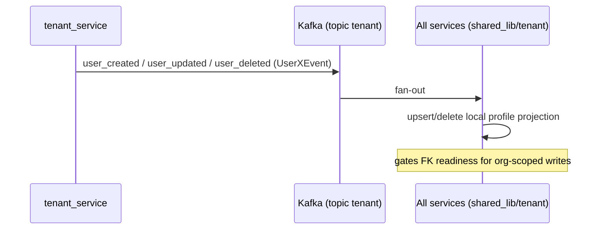
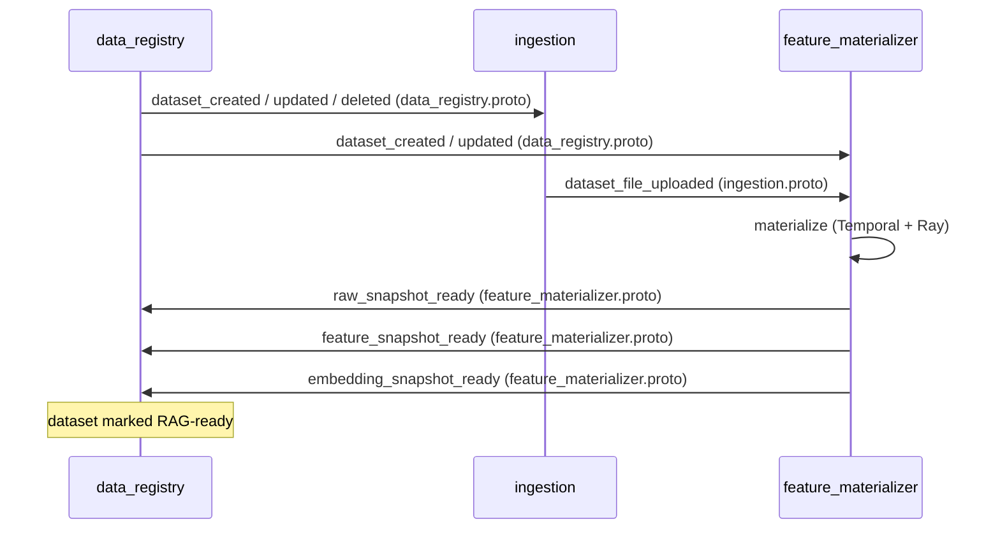
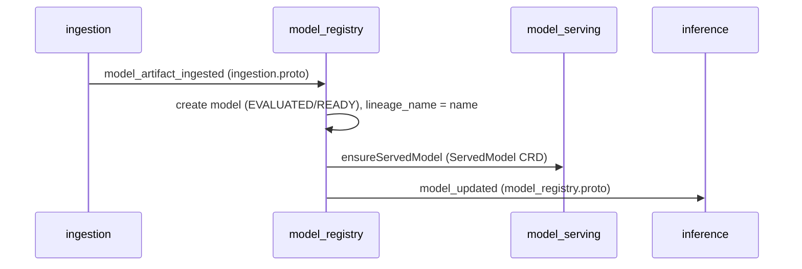
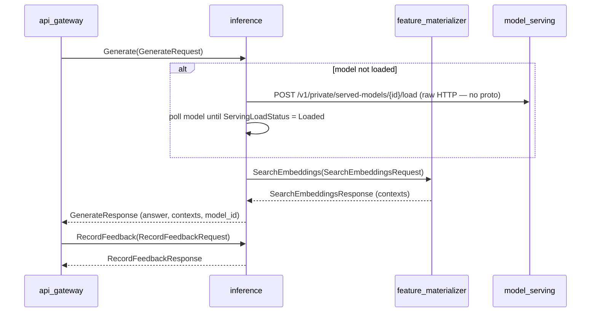
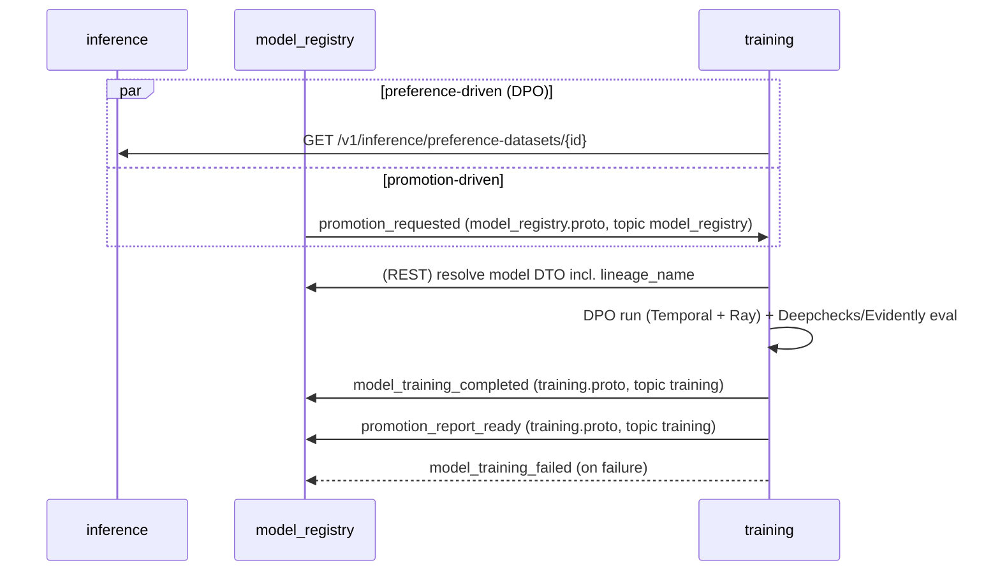
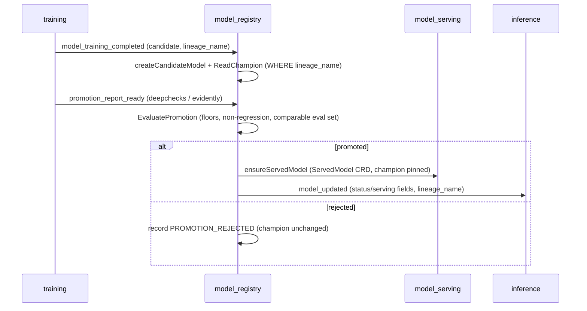
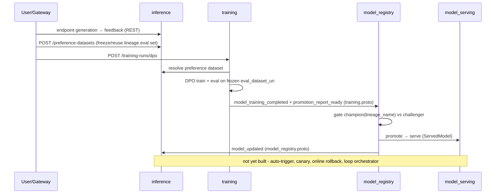

# Data Contracts Across Services

This document traces every data contract between the services in the platform —
asynchronous events (Postgres outbox → Kafka) and synchronous calls (gRPC / HTTP) —
surfaces the holes and misalignments found, and provides sequence diagrams grouped by
flow.

Related: [The Self-Improving Loop](self-improving-loop.md), [Multi-LoRA Serving](multi-lora-serving.md).

## Contract inventory

### Asynchronous events

Type registry: `shared_lib/messaging/message.go`. Delivery is via the transactional
outbox (`shared_lib/messaging`) onto Kafka topics.

| Event | Proto | Publisher | Subscriber(s) | Topic |
| --- | --- | --- | --- | --- |
| `user_created` / `user_updated` / `user_deleted` | profile.proto | tenant_service | all services (`shared_lib/tenant`) | `tenant` |
| `dataset_created` / `dataset_updated` / `dataset_deleted` | data_registry.proto | data_registry | ingestion, feature_materializer, inference¹ | `data_registry` |
| `dataset_file_uploaded` | ingestion.proto | ingestion | feature_materializer | `ingestion` |
| `raw_snapshot_ready` / `feature_snapshot_ready` / `embedding_snapshot_ready` | feature_materializer.proto | feature_materializer | data_registry | `feature_materializer` |
| `model_artifact_ingested` | ingestion.proto | ingestion | model_registry | `ingestion` |
| `promotion_requested` | model_registry.proto | model_registry | training | `model_registry` |
| `model_training_completed` / `model_training_failed` | training.proto | training | model_registry | `training` |
| `promotion_report_ready` | training.proto | training | model_registry | `training` |
| `model_updated` | model_registry.proto | model_registry | inference | `model_registry` |

¹ inference only consumes `dataset_updated`.

Every event type has exactly one publisher and at least one live subscriber, and
publisher/subscriber topics are aligned.

### Synchronous calls

| Caller → Callee | Contract | Kind |
| --- | --- | --- |
| api_gateway → inference | endpoint generation, feedback, preference datasets | REST/JSON |
| inference → feature_materializer | `SearchEmbeddings` | gRPC (feature_materializer.proto) |
| inference → model_serving | `POST /v1/private/served-models/{id}/load` | **raw HTTP, no proto** |
| data_stream → data_registry | `ReadSourceConnector`, `ReadDatasetTable` | gRPC (data_registry.proto) |
| training → model_registry | model resolver (reads model DTO incl. `lineage_name`) | REST/JSON |
| training → inference | preference dataset resolver | REST/JSON |

## Sequence diagrams

### Flow A — Tenant identity projection

### Flow B — Data ingestion & materialization

### Flow C — Model artifact upload path

### Flow D — RAG inference runtime (synchronous)

### Flow E — Training ← registry / inference

### Flow F — Promotion gate & serving swap

### Flow G — The self-improving loop (composite)

